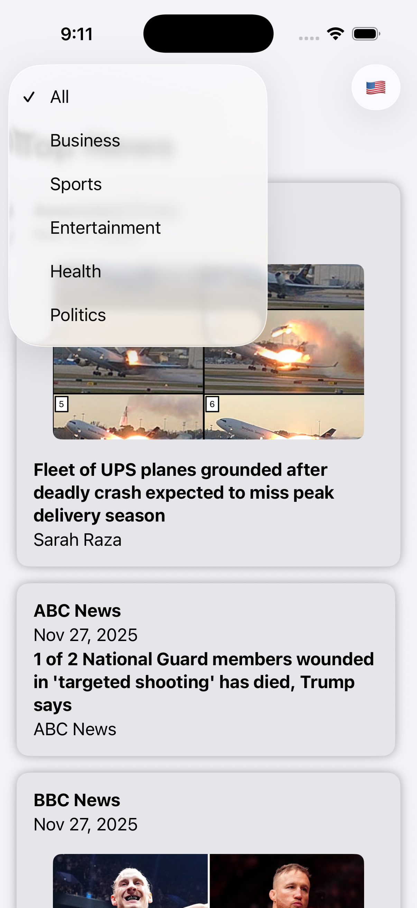

# News App (SwiftUI + MVVM)

An iOS application built with **SwiftUI**, **Combine**, and the **NewsAPI** service.  
The app fetches real-time headlines and allows users to filter news by **country** and **category** (All, Business, Sports, Politics).

> **Note:** Due to the limitations of my NewsAPI tier, only **United States** headlines can be displayed. The API does not permit country-level filtering on the free plan, but the app supports the UI and endpoint logic for multi-country selection.

---

## Features

### Real-Time News Fetching
- Integrates with **NewsAPI** to retrieve top headlines.
- Uses a custom async API client to load and parse article data.

### Country Filter
- Toolbar menu lets users select between multiple countries.
- Selecting a country updates the endpoint dynamically.
- **Free tier restriction:** NewsAPI only returns `country=us`.

### Category Picker
- Category filter with: **All**, **Business**, **Sports**, **Politics**.
- Uses `URLComponents` to construct dynamic API URLs.
- Changing the category triggers automatic reload of results.

### Clean MVVM Architecture
- `NewsViewModel` handles data loading, filtering, and endpoint creation.
- `ArticleViewModel` exposes formatted article properties to the UI.
- `ContentView` displays a polished feed of news articles.

### Image Loading
- Uses `AsyncImage` with loading, error, and placeholder states.

### In-App Article Viewer
- Opens full articles inside a `SafariView` sheet.

---

## Architecture Overview
- `NewsAPI` → `APIClient` → `NewsViewModel` → `ContentView` → `User Interaction`

### API Layer
- Uses `URLComponents` for safe parameter construction.
- Handles networking through a reusable `APIClient`.

### View Model Layer
- Stores selected country and category as `@Published` state.
- Rebuilds the request URL on every filter change.
- Publishes article data for SwiftUI to render.

### View Layer
- Renders a scrollable news feed with images and metadata.
- Provides toolbar pickers for filtering.
- Presents article content in a full-browser sheet.

---

## Technologies Used

- **SwiftUI**
- **Combine**
- **MVVM Architecture**
- **URLComponents**
- **NewsAPI**
- **SafariServices**
- **AsyncImage**

---

## Screenshots

  
  
  

